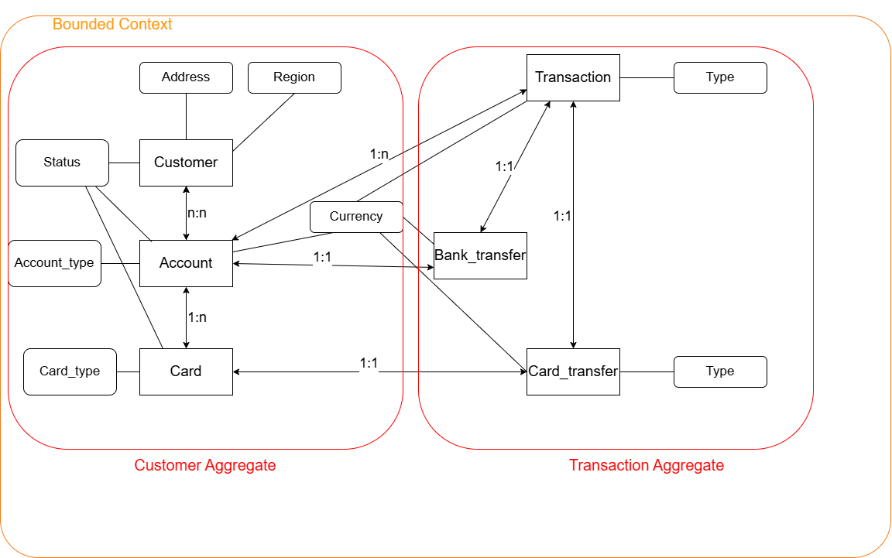

## Domain Driven Design - Adam Zientek

### 1. Opis bounded-context

Aplikacja mobilna bankowa pozwala Klientowi indywidualnemu na:

* zarządzanie swoimi danymi - edycja danych osobowych, usunięcie swoich danych z banku (i zamknięcie wszystkich rachunków),
* zarządzanie kontem - zamknięcie, otworzenie, edycja konta,
* wykonywanie przelewów,
* podgląd transakcji - przelewów i płatności kartą,
* zarządzanie kartami debetowymi/kredytowymi - zamówienie karty, zablokowanie/usunięcie karty,
* uwierzytelnienie w aplikacji (w encji Klient nie ma atrybutu hasło, ponieważ aplikacja w celu weryfikacji hasła komunikuje się z zewnętrznym Bankowym systemem uwierzytelniania - chcę uniknąć przechowywania hasła klienta w aplikacji mobilnej nawet w postaci hashu).

### 2. Diagram

Legenda:

ostre kąty - encje

zaokrąglone rogi - obiekty wartości

### 3. Opis encji i obiektów wartości

### Encje:

**Customer** - opisuje klienta Banku. Klient jest rozumiany jako osoba fizyczna (w tym przypadku nie rozważam klientów będących np. firmą). Klient posiada następujące atrybuty:

* **Customer\_id** - String (dokładnie 6 cyfr) - służy do logowania klienta i jego identyfikacji w Banku,
* **Names** - String (max 100 znaków) imię lub imiona klienta,
* **Last\_name** - String (max 50 znaków) nazwisko klienta,
* **Address** - obiekt wartości (opisany później) - adres zamieszkania klienta,
* **ID\_number** - String (dokładnie 9 znaków - 3 litery + 6 cyfr) - numer dowodu klienta,
* **Pesel** - String (dokładnie 11 cyfr) - numer Pesel klienta,
* **Email** - String (max 30 znaków - według standardowego regexu adresu email) - adres email klienta,
* **Phone** - Obiekt, składający się z Region (Obiekt wartości jako String max 5 znaków z kodem regionu np. +48) i phone\_number (String max 11 znaków) - nr telefonu klienta
* **Status** - Obiekt wartości ze stringami: "Active", "Disactivated".

**Transaction** - transakcje na koncie klienta, reprezentuje same zmiany na koncie, nie cały zapis transakcji:

* **Type** - Obiekt wartości ze stringami "Card", "Bank\_transfer",
* **Account\_id** - String (dokładnie 26 cyfr) numer konta bankowego,
* **Transfer\_id** - tylko jeśli Type==Bank\_transfer; id dokonanego przelewu,
* **Payment\_id** - tylko jeśli Type==Card; id płatności kartą,
* **Difference** - Signed float - różnica w saldzie konta przez transakcję
* **Post\_trans\_saldo** - Signed float - saldo konta po operacji,
* **Currency** - waluta transakcji,
* **Date** - format datetime - data i godzina transakcji.

**Bank\_transfer** - encja reprezentuje przelew bankowy

* **Transfer\_id** - String (dokładnie 20 znaków) id dokonanego przelewu,
* **Sender\_account\_id** - String (dokładnie 26 cyfr) numer konta bankowego nadawcy,
* **Recipient\_account\_id -** String (dokładnie 26 cyfr) numer konta bankowego odbiorcy,
* **Amount** - obiekt składający się z: obiektu wartości Currency (kod 3 znaki) i value (float) - wartość transakcji (jej wpływ na konto poznajemy przez encję Transaction),
* **Title -** String (max 60 znaków) - tytuł przelewu.

**Card\_transfer -** encja reprezentująca płatność kartą

* **Payment\_id -** String (dokładnie 20 znaków) id płatności,
* **Type** - obiekt wartości - Online, Touch, Standard - rodzaj transkacji kartą,
* **Card\_id** - String (dokładnie 16 cyfr) numer karty użytej do płatności,
* **Recipient\_name** - String (max 30 znaków) nazwa odbiorcy płatności (w przypadku zwrotu - płatnika),
* **Recipient\_ref\_id** - String (dokładnie 16 znaków) - numer referencyjny odbiorcy/płatnika,
* **Amount** - ten sam obiekt co w Bank\_transfer.

**Account** - encja reprezentująca konto bankowe

* **Account\_id** - String (dokładnie 26 cyfr) numer konta bankowego,
* **Account\_type -** obiekt wartości - enum z typami konta np. Savings, Credit,
* **Client\_ids** - lista id klientów (bo może być współdzielone),
* **Saldo** - Signed float - saldo konta,
* **Currency** - obiekt wartości z kodem waluty używanej na koncie,
* **Status -** obiekt wartości ze stringami: "Active", "Disactivated",
* **Create date** **-** datetime, data utworzenia konta.

**Card** - encja reprezentująca kartę przypisaną do konta:

* **Card\_id** - String (dokładnie 16 cyfr) - numer karty,
* **Account\_id** - numer konta z encji Account,
* **Expiry\_date** - String (dokładnie 5 znaków - format MM/YY) - miesiąc, w którym karta przestanie działać
* **Card\_type** - obiekt wartość z typem karty Debit lub Credit,
* **Daily\_limit** - Currency + limit\_value jako unsigned float - dzienna kwota limitu transakcji,
* **Status -** obiekt wartości ze stringami: "Active", "Disactivated",
* **Available\_funds** - unsigned float - dostępne środki na karcie.

### Obiekt wartości Address:

* Street - String (max 100)
* Building\_no - String (max 8)
* Apartment\_no - opcjonalny String (max 6)
* City - String (max 50)
* Postal\_code - String (format: XX-XXX)
* Country - String (max 30)
